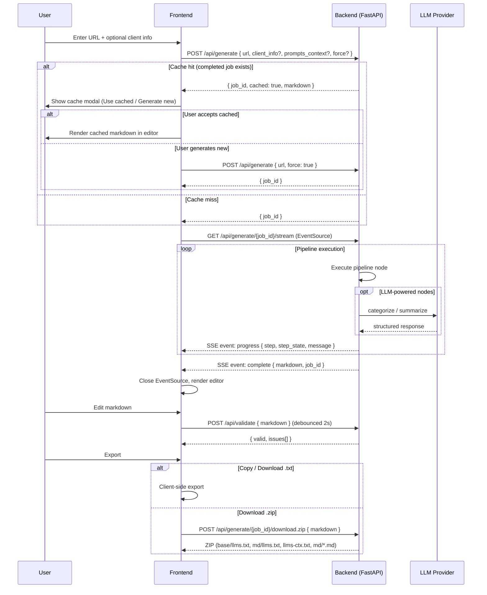
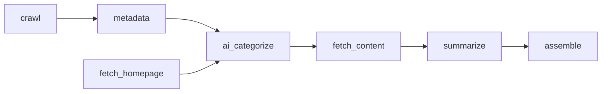
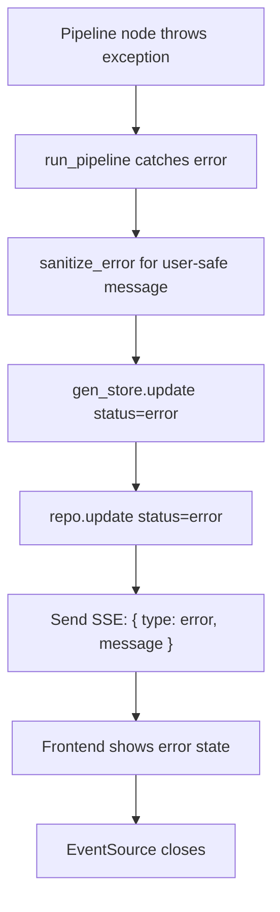

# llms.txt Generator

A web application that crawls a website, extracts metadata, uses an LLM to categorize and summarize pages, and produces a spec-compliant [llms.txt](https://llmstxt.org/) file you can edit, reprompt, and download.

## Architecture

| Layer | Stack |
|-------|-------|
| Frontend | React 19, Vite 6, Tailwind CSS 4, TypeScript |
| Backend | FastAPI, Python 3.14 |
| LLM Providers | Anthropic Claude / OpenAI (swappable) |
| Database | Supabase (PostgreSQL) or in-memory fallback |
| Deployment | Vercel (frontend + backend) |

## Prerequisites

- **Python 3.14+**
- **Node.js 24+**
- An API key from at least one LLM provider (see below)

## Getting API Keys

| Provider | Where to get a key |
|----------|-------------------|
| **Anthropic (Claude)** | [console.anthropic.com](https://console.anthropic.com/) |
| **OpenAI** (alternative) | [platform.openai.com/api-keys](https://platform.openai.com/api-keys) |

## Backend Setup

```bash
cd backend
python3 -m venv .venv
source .venv/bin/activate
pip install -e ".[dev]"
cp .env.example .env
```

Edit `backend/.env` with your configuration:

```env
# LLM Provider — "anthropic" or "openai"
LLM_PROVIDER=anthropic
ANTHROPIC_API_KEY=sk-ant-...
OPENAI_API_KEY=              # only needed if LLM_PROVIDER=openai
LLM_MODEL=claude-sonnet-4-20250514

# Supabase (optional — see Supabase Setup below)
SUPABASE_URL=
SUPABASE_KEY=

# Crawl settings
MAX_PAGES=50
CRAWL_TIMEOUT=30

# App
FRONTEND_URL=http://localhost:5173
MOCK_LLM=true                # set to true to skip LLM calls and return fixture data
```

Start the API server:

```bash
uvicorn app.main:app --reload
```

The backend runs at `http://localhost:8000`. Check health at `/health`.

## Frontend Setup

```bash
cd frontend
npm install
cp .env.example .env
```

Edit `frontend/.env`:

```env
VITE_API_URL=http://localhost:8000
```

Start the dev server:

```bash
npm run dev
```

The frontend runs at `http://localhost:5173` and proxies `/api` requests to the backend.

## Supabase Setup (Optional)

The app works out of the box with in-memory storage. To persist generations across restarts, connect a Supabase project.

1. Create a project at [supabase.com](https://supabase.com/)
2. Add your project URL and anon/service key to `backend/.env`:

   ```env
   SUPABASE_URL=https://<project-ref>.supabase.co
   SUPABASE_KEY=eyJ...
   ```

3. Create the `generations` table. Run this SQL in the Supabase SQL Editor:

   ```sql
   create table generations (
     id text primary key,
     url text not null,
     url_normalized text not null,
     status text not null default 'pending',
     client_info text,
     prompts_context jsonb default '[]',
     markdown text,
     markdown_md text,
     llms_ctx text,
     child_pages jsonb default '[]',
     pages_found integer,
     error text,
     created_at timestamptz default now(),
     updated_at timestamptz default now()
   );

   create index idx_generations_url_normalized on generations (url_normalized);
   create index idx_generations_status on generations (status);
   ```

When `SUPABASE_URL` and `SUPABASE_KEY` are set, the app automatically uses Supabase. Otherwise it falls back to in-memory storage.

## API Endpoints

| Method | Path | Description |
|--------|------|-------------|
| `GET` | `/health` | Health check |
| `POST` | `/api/generate` | Start a new generation job |
| `GET` | `/api/generate/{job_id}/stream` | SSE stream for job progress |
| `POST` | `/api/generate/{job_id}/download.zip` | Download full archive (base, md, ctx) |
| `POST` | `/api/reprompt` | Modify existing markdown via LLM |
| `POST` | `/api/validate` | Validate llms.txt against spec |

## System Workflow

### Request / Response Flow



### Pipeline DAG

Each node sends progress events via SSE as it executes. Nodes run in dependency order — nodes at the same level can run concurrently.



### Pipeline Node Details

| Node | Key | Input | Output | LLM? |
|------|-----|-------|--------|------|
| Crawl | `crawl` | URL | `discovered_urls` (ranked, capped) | No |
| Extract Metadata | `metadata` | `discovered_urls` + HTML cache | `pages` (PageMeta[]) | No |
| Fetch Homepage | `fetch_homepage` | URL | `homepage_markdown` | No |
| AI Categorize | `ai_categorize` | `pages` + `homepage_markdown` + `client_info` | `structured_data` (sections) | Yes |
| Fetch Content | `fetch_content` | `structured_data` pages | `child_pages` (ChildPageContent[]) | No |
| Summarize | `summarize` | `child_pages` + `structured_data` | `llms_ctx` + refined descriptions | Yes |
| Assemble | `assemble` | `structured_data` + `child_pages` | `markdown_base` + `markdown_md` | No |

### SSE Event Types

| Event | Payload | When |
|-------|---------|------|
| `progress` | `{ status, step, step_state, message, detail?, summary?, pages_found? }` | During each pipeline node |
| `complete` | `{ markdown, job_id }` | Pipeline success |
| `error` | `{ message }` | Pipeline failure |

`step_state` transitions: `started` → `progress` (0..n) → `completed`

### Error Flow



## Deployment

- **Frontend** — Vercel (root directory: `frontend`, framework: Vite)
- **Backend** — Vercel (root directory: `backend`, start: `uvicorn app.main:app --host 0.0.0.0 --port $PORT`)
- **Database** — Supabase

Set `VITE_API_URL` on Vercel to your backend URL. Set `FRONTEND_URL` on the backend to your Vercel frontend domain.

## Running Tests

```bash
cd backend
source .venv/bin/activate
python3 -m pytest tests/
```

Set `MOCK_LLM=true` in your `.env` to run tests without consuming API credits.
